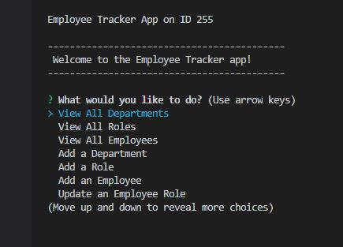
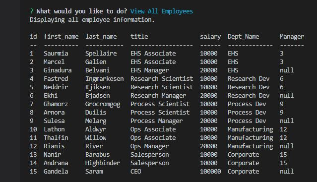

# Employee Tracker

  

  ## Description
  This is a command line application using a SQL database to create, read, update and delete employee data.

  #### Screenshots of the app:

  

  

  ## Table of Contents 
  - [Usage](#usage)
  - [Tech Used](#tech-used)
  - [Questions](#questions)
  - [Links](#links)
  - [License](#license) 
  
  ## Usage
  - Answer the questions when prompted in the command line.
  - Choose an option to either view employee information or to add a new employee, role or department.

  ## Tech Used
  - Node.js
  - MySQL/MySQL2
  - Inquirer
  
  ## Questions
  Please visit my **[GitHub profile](https://github.com/tchestnut85/)** to check out this and other projects I've created and contributed to.
  If you have any specific questions about this project, please contact me at <tchestnut85@gmail.com>.

  ## Links
  - **[GitHub Repo](https://github.com/tchestnut85/employee-tracker/)**
  - **[Video Walkthrough](https://drive.google.com/file/d/1-Ckfl2VDIUkrbM6R1lzqzx589zj3JhN2/view?usp=sharing)**

  ## License
  
  
  This app is licensed under the MIT license.
